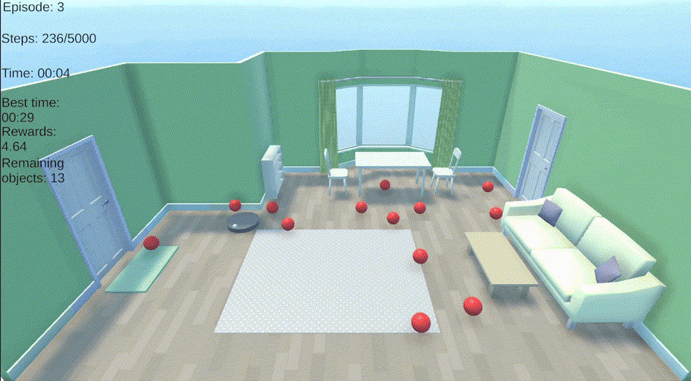

# Roomba Agent

  

A reinforcement learning project built in Unity using the ML-Agents toolkit.

The project simulates an autonomous vacuum cleaner (Roomba-like agent) that learns how to navigate a room, collect objects, and avoid colliding with furniture through reinforcement learning.

## Agent Setup

### Observations
- 32 sphere cast sensors for collectible objects
- 32 sphere cast sensors for furniture/obstacles

### Actions

Movement:
- forward
- backward
- idle

Rotation:
- left
- right
- idle

### Rewards
- +1 for collecting an object
- +100 for collecting all objects
- +50 bonus for completing the episode without furniture collisions
- -0.01 time penalty per step
- penalties for furniture collisions - proportional with furniture displacement

### Episode Ends
- all objects collected
- maximum step limit reached
- too many furniture collisions

## Current Agent Behavior

The current model is capable of:
- collecting all objects
- navigating around furniture
- avoiding most collisions with obstacles

The project also explored:
- reward balancing
- emergent behaviors
- unintended reward exploitation
- reinforcement learning curriculum experimentation

### Technologies Used

- Unity
- Unity ML-Agents
- PPO (Proximal Policy Optimization)
- C#
